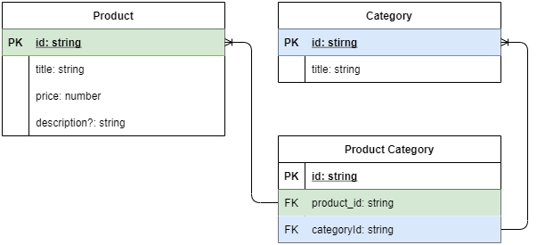

# TypeScript - CRUD užduotis - Duomenų atvaizdavimas lentele

## Užduoties tikslas

Atvaizduoti duomenis HTML lentele, pagal esybių schemą.

### Failų struktūra
* __components/__ - aplankas skirtas komponentams - klasėms, kurios naudojamos atvaizduoti elementams DOM'e

* __data/__ - duomenų failai

* __helpers/__ - pagalibinės funkcijos ir klasės, skirtos kodo švarinimui ir perpanaudojimui

* __types/__ - bendrai naudojami tipai

### Esybių ryšių diagrama (entity relation diagram).

## Darbo atlikimo eiga 

1. Aplanke __./types__ sukurkite tipus.
   1.  Implementuokite tipus pagal schemą "__./product-category-entity-relation.png__". 
   2.  Papildomai sukurkite tipą  __product-joined.ts__ tipas turi turėti tokias savybes:
       * id: string
       * title: string
       * price: number
       * categories: string
       * description?: string

2. __./helpers/products-collection.ts__ 
   1. Sukurkite konstruktorių, kuris priimtų produktus, kategorijas ir produktų kategorijas. Gautus parametrus išsaugokite kuriamam objekte.
   2. Sukurkite privatų metodą __joinProduct__ kuris apjungtų vieną produktą
      * šiame metode turite surasti visas produktui priklausančias kategorijas ir sujungti tų kategorijų pavadinimus atskyrus kableliu. 
   3. Sukurkite get'erį __all__, kurį panaudojus gautumėte visus apjungtus produktus.

3. __./components/app.ts__
   1. Sukurkite savybes:
      1. private htmlElement: HTMLElement;
      2. private productsCollection: ProductsCollection;
   2. Sukurkite konstruktorių, kuris
      1.  priimtų selektorių ir pagal jį rastą elementą priskirtų į __htmlElement__ savybę. Jeigu elementas nerastas, turi būti metama klaida.
      2.  sukurtų pradinį __productsCollection__ objektą perduodant jam duomenis iš __src/data/__ aplanko
   3. Sukurkite metodą __initialize__, kuriame bus atliekami komponento atvaizdavimo veiksmai, kolkas palikite jį tuščią arba su pavyzdiniu kodu.

4. __./components/table.ts__ 
   1. Sukurkite tipą TableProps<Type>:
      1. title: string
      2. columns: Type
      3. rowsData: Type[]
   2. Sukurkite savybes:
      1. public htmlElement: HTMLTableElement;
      2. private props: TableProps<Type>;
      3. private tbody: HTMLTableSectionElement;
      4. private thead: HTMLTableSectionElement;
   3. Sukurkite konstruktorių, kuris:
      1. priimkite TableProps<Type> tipo duomenis __props__
      2. patikrintų  __props__ duomenų suderinamumą - kiekvienos eilutės elementų skaičius turi būti lygus stulpelių skaičiui
         1. Tam sukurkite papildomą metodą: __checkColumnsCompatability__
      3. priskirkite gautus __props__ į savybę __this.props__
      4. sukurkite pradinius htmlElement, thead ir tbody elementus
      5. sukurkite tuščią metodą __initialize__  ir jį iškvieskite
   4. Implementuokite metodą __initialize__:
      1. implementuokite lentelės antraštės atvaizdavimą, tai darykite kviesdami atskirą metodą __initializeHead__
      2. implementuokite lentelės duomenų atvaizdavimą, tai darykite kviesdami atskirą metodą __initializeBody__
      3. stilizuokite lentelės elementą ir prijunkite lentelės antraštę ir atvaizduotus duomenis

5. __./components/app.ts__
   1. papildykite __initialize__ metodą, jog būtų įterpiama lentelė

## Rezultato pavyzdys

## Atsakymai
   * Galite peržiūrėti sprendimą aplanke __atsakymas__
  