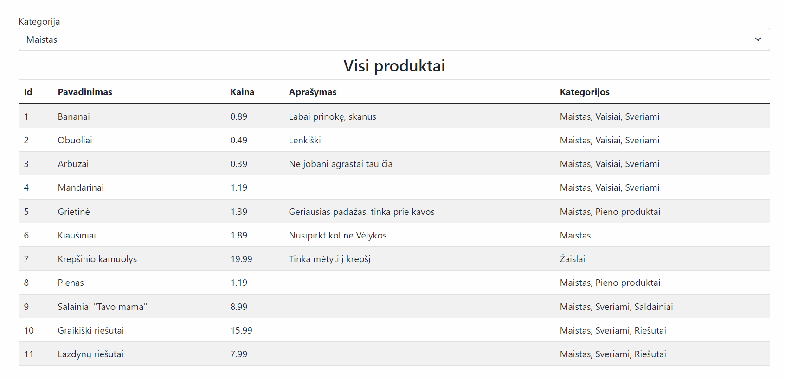
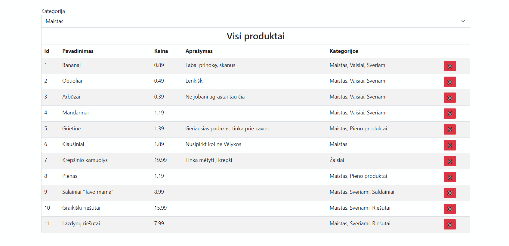

# TypeScript - CRUD užduotis 2

## Užduoties tikslas

Tęsiame praeitos pamokos darbą naudodami tą patį projektą. Praeitos pamokos pabaiga, yra šios pamokos pradžia.
Jūsų pamokos tikslas įgalinti duomenų trynimą ir filtravimą.

Ši užduotis nėra lengva, todėl atidžiai sekite instrukcijas __Eiga__ skiltyje. Po kiekvieno punkto peržiūrėkite atsakymus. 

## Eiga

Atsidarykite atsakymų aplanką atskirame projekte. Įsirašykite bibliotekas, pasileiskite projektą.
Peržiūrėjus veikimą, tuomet peržiūrėkite kodą.

Susipažinus su rezultatu, pradėkite jį vystyti aplanke __./pradiniai failai__.
Po kiekvieno punkto, pasitikrinkite su atsakymų aplanku.

### Filtravimas - pagal kategoriją
1. Sukurkite komponentą __SelectField__, skirtą pasirinkti produktų kategorijai
   1. Pirmiausiai įgalinkite atvaizdavimą, kuris rodytų bet kokius 3 pasirinkimus naudojant __&lt; select &gt;__
   2. Išanalizuokite kokių parametrų reikia, kad suformuoti pasirinkimą? Kelis pasirinkimus?
   3. Perduokite masyvą tokių pasirinkimų formuojat komponentą (konstruktoriui)
   4. Naudojant konstruktoriaus parametrus priimkite funkciją, kurią iškviesite pasikeitus __&lt; select &gt;__ reikšmei
   5. Panaudokite __SelectField__ komponentą App klasėje ir prijunkite jį virš lentelės
2. __ProductsCollection__ klasėje sukurkite metodą __getByCategoryId__, kuris pasirinktų produktus pagal kategorijos id
3. __Table__ klasėje sukurkite metodą __updateProps__, kuris atnaujins Lentelės parametrus. Po lentelės parametrų atnaujinimo reikia atnaujinti ir lentelės atvaizdavimą, tam sukurkite metodą __renderView__. Šį metodą panaudokite ir pirminiui atvaizdavimui.
4. __App__ komponente sukurkite funkciją __handleCategoryChange__ kuri suderintų vaikinių komponentų tarpusavio veikimą. Šią funkciją(__handleCategoryChange__) perduokite __SelectField__ komponentui, kad pasikeitus  __&lt; select &gt;__  pasirinkimui, išsikviestų __handleCategoryChange__. Išsikvietus __handleCategoryChange__ funkcijai pakeiskite klasėje saugomą savybę __selectedCategoryId__ ir incijuokite komponento atnaujinimą kviečiant funkciją __update__.
5. __App__ komponento metode __update__ aprašykite logiką, kaip turi būti atnaujinami lentelės duomenis pagal esamas savybes __selectedCategoryId__ ir __productsCollection__.

### Trynimas - pagal produkto id
1. __Table__ komponente papildykite kiekvieną lentelės eilutę stulpeliu, kuriame būtų ištrynimo mygtukas
2. __Table__ komponente papildykite priimamus prop'sus funkcija - __onDelete__, kuri būtų iškviečiama paspaudus ištrynimo mygtuką. Kviečiant funkciją __onDelete__ nepamirškite perduoti to produkto 'id' kurį reikia ištrinti.
3. __ProductsCollection__ klasėje implementuokite ištrynimo logiką, metode __deleteProductById__
4. __App__ klasėje aprašykite metodą __handleProductDelete__ kuris ištrintų reikiamą produktą pagal id naudojant __ProductsCollection.deleteCarById__. Po ištrynimo incijuokite __App.update__ metodą.

## Papildomai

Atlikus užduotis, pabandykite suvienodinti:
  * metodų pavadinimus
  * kintamųjų pavadinimus
  * kontruktorių veikimus
  * duomenų atnaujinimo logiką
  * duomenų perdavimo logiką
  
Pabandykite susitarti su kolega-studentu, kad peržiūrėtumėte viens kito sprendimus. 
Padiskutuokite, suformuokite klausimus. Išsimiegokite.
