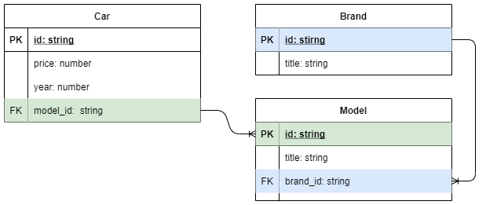
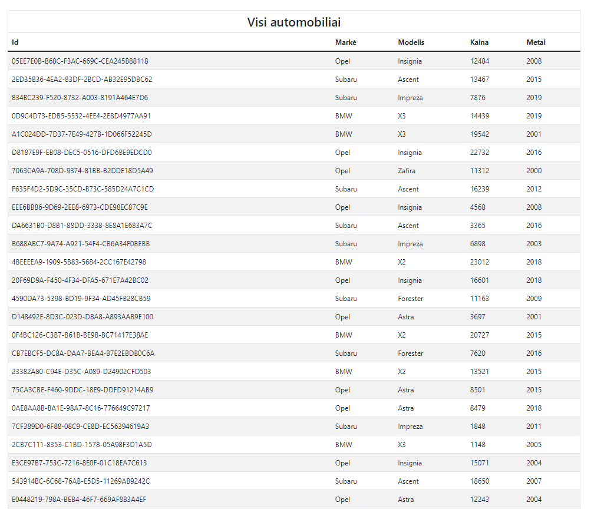

# TypeScript - CRUD užduotis 1

## Užduoties tikslas

Atvaizduoti duomenis HTML lentele, pagal esybių schemą.

### Failų struktūra
* __components/__ - aplankas skirtas komponentams - klasėms, kurios naudojamos atvaizduoti elementams DOM'e

* __data/__ - duomenų failai

* __helpers/__ - Pagalibinės funkcijos ir klasės, skirtos kodo švarinimui ir perpanaudojimui

* __types/__ - bendrai naudojami tipai

### Esybių ryšių diagrama (entity relation diagram).

## Darbo atlikimo eiga 

1. Aplanke __./types__ duoti tipų 'griaučiai'. Implementuokite tipus pagal schemą. __car-joined.ts__ tipas turi turėti tokias savybes:
   * id: string
   * price: number
   * year: number
   * brand: string
   * model: string

2. __./helpers/cars-collection.ts__ 
   1. Sukurkite konstruktorių, kuris priimtų markes, mašinas ir modelius. Gautus duomenis išsaugokite objekte
   2. Sukurkite privatų metodą __joinCar__ kuris apjungtų vieną mašiną
   3. Sukurkite metodą, kurį iškvietus gautumėte visas apjungtas mašinas.

3. __./components/app.ts__
   1. Sukurkite savybes:
      1. private htmlElement: HTMLElement;
      2. private carsCollection: CarsCollection;
   2. Sukurkite konstruktorių, kuris
      1.  priimtų selektorių ir pagal jį rastą elementą priskirtų į __htmlElement__ savybę. 
      2.  sukurtų pradinį __carsCollection__ objektą
   3. Sukurkite metodą __initialize__, kuriame būtų atliekami komponento atvaizdavimo veiksmai

4. __./components/table.ts__ 
   1. Sukurkite tipą TableProps<Type>:
      1. title: string
      2. columns: Type
      3. rowsData: Type[]
   2. Sukurkite savybes:
      1. public htmlElement: HTMLTableElement;
      2. private props: TableProps<Type>;
      3. private tbody: HTMLTableSectionElement;
      4. private thead: HTMLTableSectionElement;
   3. Sukurkite konstruktorių, kuris:
      1. sukurtų pradinius htmlElement, thead ir tbody elementus
      2. iškviestų metodą __initialize__
   4. Sukurtite metodą __initialize__, kuriame:
      1. atliktumete lentelės antraštės atvaizdavimą
      2. atliktumetė lentelės duomenų eilučių atvaizdavimą
      3. apjungtumėte elementus

5. __./components/app.ts__
   1. papildykite __initialize__ metodą, jog būtų įterpiama lentelė

## Rezultato pavyzdys

## Papildomai
  * Sukurkite lentelės duomenų patikrinimo funkciją, kuri tikrintų duomenų sutapimą su  antraštės stulpeliais
  * Kodo dalis, kurios gali būti perpanaudotos iškelkite į atskiras funkcijas aplanke __helpers__

## Atsakymai
   * GaliTE peržiūrėti sprendimą aplanke __./atsakymas__
