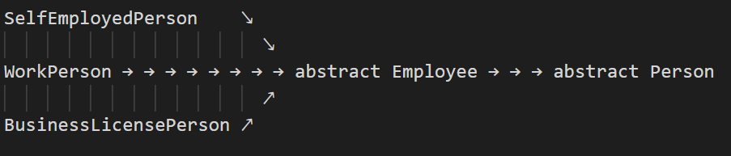

# TypeScript - OOP abstrakcija ir polimorfizmas

Šios praktikos tikslas įsisavinti abstrakcijos ir polimorfizmo žinias, naudojat abstrakčias
klases.

Turime 3 darbuotojų tipus:
  * self-employed-person - darbuotojas dirbantis pagal individualią veiklą, kuris gauna pinigus už
    išdirbtas valandas ir valandinį užmokestį;
  * work-person - žmogus kuri gauna atlygį vieną kart per mėnesį už kiekvieną darbo dieną
  * business-license-person - žmogus kuris gauna atlygį už atliktus darbus

## Klasių hierarchijos schema:
                                        

## Klasių schemos
### abstract Person 
##### savybės:
* protected id: string;
* protected name: string;
* protected surname: string;
##### metodai:
* public getPersonInfo = (): string
* public abstract toString(): string;

### abstract Employee extends Person
##### metodai:
  public abstract calcPay(): number;

### Job
##### savybės:
* private id: string;
* private finished: boolean = false;
* private payed: boolean = false;
* private dateFinished?: Date;
##### metodai:
* public completeJob = (): void
* public setJobPayed = (): void
* public getPay = (): number
* public isFinished = (): boolean
* public isPayed = (): boolean
* public toString = (): string

### BuisnessLicencePerson extends Employee
##### savybės:
* private jobs: Job[];
##### metodai:
* public calcPay = (): number
* public override toString(): string

### SelfEmployedPerson extends Employee 
##### savybės:
* private hourPay: number;
* private hoursWorked: number;
##### metodai:
* public calcPay = (): number
* public override toString(): string
  

### WorkPerson extends Employee 
##### savybės:
* private hourPay: number;
* private fullTimeEquivalent: number;
##### metodai:
* public calcPay = (): number
* public override toString(): string
  
  
## Užduotis
Jūsų praktikos darbo esmė, sukurti abstrakčias klases, kurios įpareigotų vaikes klases
implementuoti abstrakčius metodus. Kiekviena konkreti klasė (SelfEmployedPerson, WorkPerson ir
BuisnessLicencePerson) turi savaip apskaičiuoti užmokestį:
* WorkPerson - pagal darbo dienas mėnesyje
* SelfEmployedPerson - pagal išdirbtas valandas
* BuisnessLicencePerson - pagal atliktus darbus (Job)

Pavaizduokite teisingą klasių sudarymo ir algoritmų aprašymo veikimą:
1. Atspausdinkite visus darbuotojus naudodami implementuota metodą toString()
2. Atspausdinkite visų darbuotojų atlyginimus anudodami implementuotą metodą calcPay()
